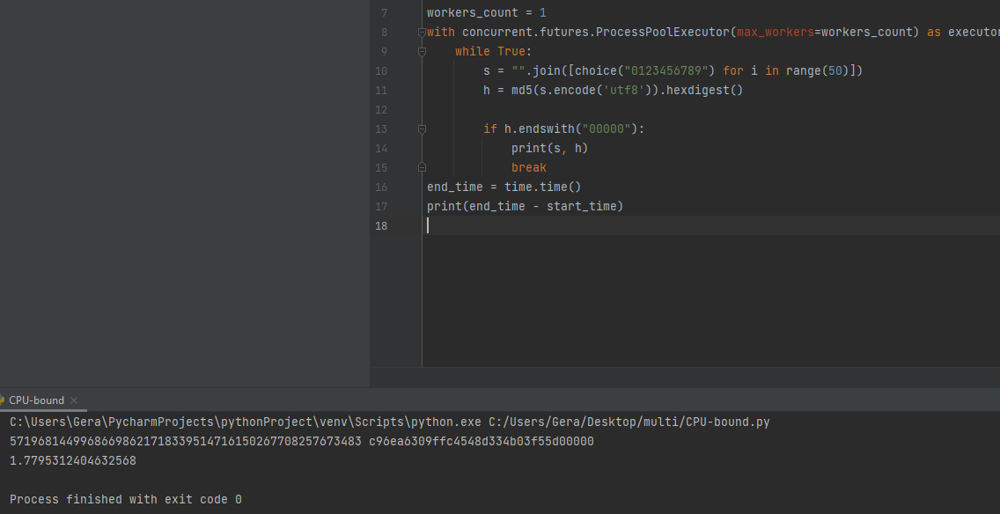
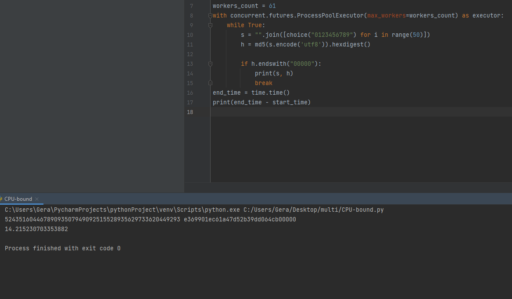

Сучков Георгий АТ-09. При синхронной обработке ссылок затраченное время составило 1626 секунд.

Нагрузки на CPU и на оперативную память не было, также как и на интернет.

При 5 workers время на обработку составило 351 секунду

Нагрузки на CPU и на оперативную память не было, также как и на интернет.
(Скрин называет 5 workers cpu.png в папке скрин, криво закинул на гит его)

При 10 воркерах обработка составила 296 секунд

Нагрузки на CPU и на оперативную память не было, а интернет уже полетел вверх до 3.2 мб/с.

При 100 воркерах обработка составила 170 секунд

Нагрузки на CPU и на оперативную память не было, а интернет уже полетел вверх до 4 мб/с.

В общем, из-за сильного процессора и большей оперативной памяти на частоте 3300 программа не влияла на производительность. Влияние произошло только на интернет

CPU-BOUND Генерация монет

1 монета с 1 воркером сгенерировалась за 1.7 секунд).

При такой быстрой генерации не успел сделать скриншот загрузки компьютера.

1 монета с 2-мя воркерами сгенерировалась за 60 секунд. То ли баг произошел, то ли что, но это единственный долгий результат, походу один поток занят другими делами)

Нагрузки никакой не было.

1 монета с 4-мя воркерами сгенерировалась за 3.4 секунд.

Чуть чуть поднялась нагрузка на процессор, но я уверен это на уровне погрешности.

1 монета с 5-ью воркерами сгенерировалась за 10.6 секунд.

Чуть чуть поднялась нагрузка на процессор, но я уверен это на уровне погрешности.

1 монета с 10 воркерами сгенерировалась за 8.6 секунд.

Чуть чуть поднялась нагрузка на процессор, но я уверен это на уровне погрешности.

1 монета с 100 воркерами сгенерировалась за ошибку, ведь библиотека поддерживает максимально 61 воркера

1 монета с 61 воркерами сгенерировалась за 14 секунд.

Чуть чуть поднялась нагрузка на процессор.

В итоге что с 1 воркером, что с 61, нагрузка не сильно менялась. 

